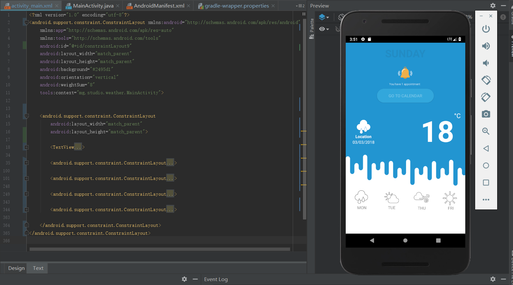
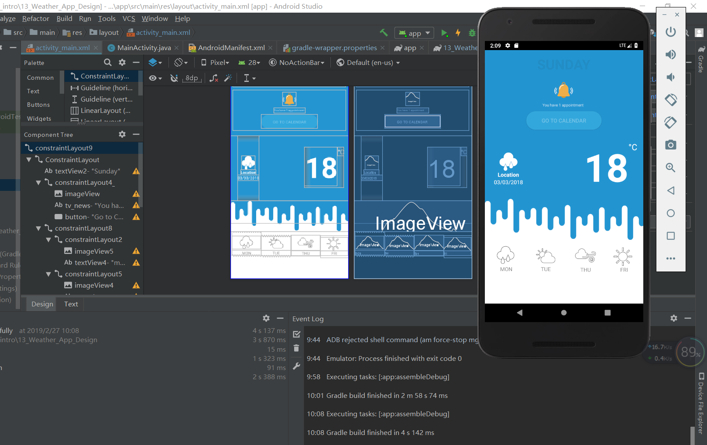
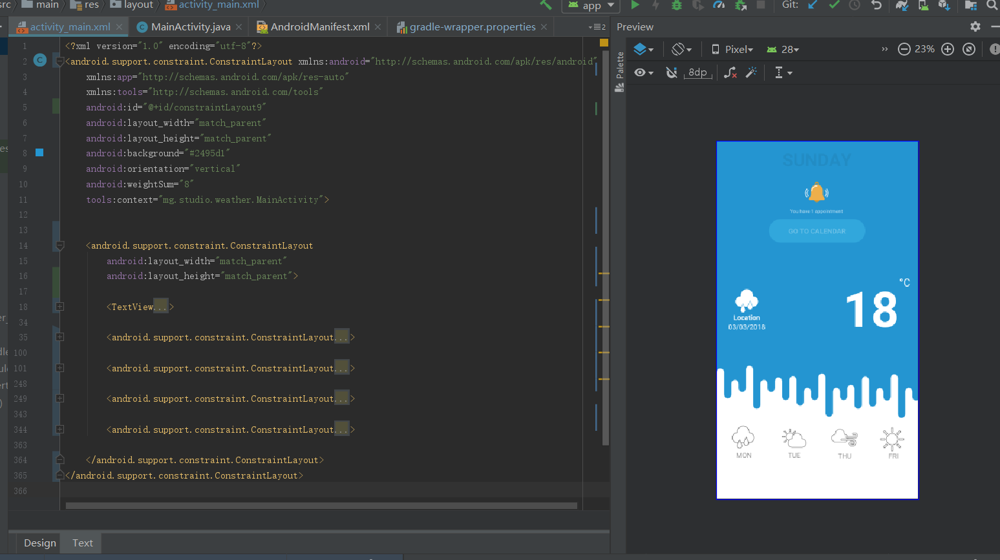

## Weather application

The layout of this application was based on the use of a LinearLayout. 

Each LinearLayout has been changed into ConstraintLayout correctly.

Original project at https://github.com/dragona/Android_intro/tree/master/13_Weather_App_Design

Thanks Dr.Feno and assistant teacher for your help.

